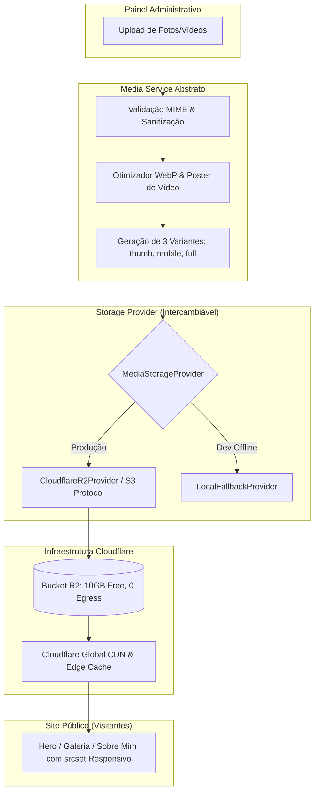

# Guia de Arquitetura, Infraestrutura & Migração Cloudflare
## Nua Borges — Plataforma Oficial & Painel Administrativo

> **Documento de Engenharia & Transferência de Propriedade**  
> **Objetivo:** Estabelecer uma camada de mídia desacoplada de alta performance, custo zero no plano Free da Cloudflare, com migração simplificada entre contas sem alteração de código.

---

## 1. Arquitetura da Camada de Mídia

A arquitetura do projeto segue o padrão **Decoupled Provider Architecture (Camada Abstrata de Mídia)**. Nenhuma tela, componente visual ou rota do Next.js conversa diretamente com a Cloudflare ou possui referências fixas (hardcoded) à conta do desenvolvedor.



### Por que esta arquitetura é 100% à prova de lock-in?
1. **Contrato de Interface (`MediaStorageProvider`):** O sistema se comunica exclusivamente com a interface em [`lib/media/types.ts`](file:///c:/Users/Philippe/Desktop/nuaborges/nuasite/lib/media/types.ts). Se amanhã for necessário trocar a Cloudflare por AWS S3, Google Cloud Storage, Wasabi ou Supabase Storage, basta criar um novo provider e alterar uma única variável de ambiente.
2. **Armazenamento de Chaves Abstratas:** O banco de dados e o estado da aplicação gravam apenas o `objectKey` (ex: `media/media-1740000000-abc/full.webp`) e metadados (`width`, `height`, `sizeBytes`). A URL final é montada em tempo de execução via [`resolveMediaUrl()`](file:///c:/Users/Philippe/Desktop/nuaborges/nuasite/lib/media/urlResolver.ts).
3. **Isolamento de Credenciais:** As chaves de acesso R2 (`accessKeyId` e `secretAccessKey`) **nunca** chegam ao navegador do visitante ou do administrador.

---

## 2. Estratégia de Otimização & Economia no Plano Free ($0/mês)

A Cloudflare possui serviços pagos como o **Cloudflare Images** ($5/mês) e o **Cloudflare Stream** ($5 a cada 1.000 minutos). Para cumprir a exigência de **máxima economia no plano gratuito**, desenhamos a seguinte estratégia:

### 2.1 Imagens (JPG, PNG, WebP, AVIF)
Em vez de pagar por transformações dinâmicas na nuvem, o processamento ocorre no próprio navegador do administrador através do motor [`lib/media/optimizer.ts`](file:///c:/Users/Philippe/Desktop/nuaborges/nuasite/lib/media/optimizer.ts) via Canvas HTML5 de alta fidelidade:
* **Remoção de Metadados:** Dados EXIF sensíveis (localização GPS, modelo da câmera, data de captura) são expurgados na renderização.
* **Geração Automática de 3 Variantes:**
  1. `thumb.webp` (máx. 400px, qualidade 80): Utilizada no grid do acervo do admin e miniaturas (~15 KB a 30 KB).
  2. `mobile.webp` (máx. 800px, qualidade 82): Entregue em telas de smartphones (~50 KB a 90 KB).
  3. `full.webp` (máx. 1600px, qualidade 85): Entregue na Hero e em monitores de alta resolução (~140 KB a 220 KB).
* **Economia Real:** Uma foto original de 8 MB tirada em estúdio é reduzida para cerca de 220 KB em `full.webp` (-97% de peso), mantendo nitidez visual de luxo.
* **Consumo de Quota R2:**
  - Armazenamento gratuito: **10 GB** (suficiente para mais de 35.000 imagens otimizadas).
  - Tráfego de saída (Egress): **Ilimitado e Gratuito** (diferente da AWS, o R2 tem taxa zero de egress).
  - Leituras gratuitas (Classe B): **10.000.000 requisições/mês**.
  - Gravações gratuitas (Classe A): **1.000.000 requisições/mês**.

### 2.2 Vídeos (MP4, WebM)
* Sem custos de assinatura do Cloudflare Stream.
* O motor inspeciona o vídeo no momento do envio e extrai o primeiro quadro significativo (0.5s) como poster em alta resolução (`poster.webp`).
* O site exibe o poster estático imediatamente com `preload="none"`, iniciando o download do stream MP4 apenas quando o usuário aciona o vídeo ou quando entra em viewport.
* O R2 suporta nativamente requisições HTTP Byte-Range (`206 Partial Content`), permitindo avanço e streaming sem baixar o arquivo inteiro.

---

## 3. Segurança dos Subdomínios & Redirecionamento da Raiz

O projeto prevê o uso de um subdomínio para a CDN (ex: `cdn.nuaborges.com.br` ou `cdn.nuaborges.phstatic.com.br`).

### Requisitos Atendidos:
1. **Nenhum Dado Sensível Exposto:** O subdomínio da CDN não lista diretórios, não expõe endpoints de autenticação e não exibe logs ou variáveis de ambiente.
2. **Redirecionamento Automático da Raiz:** Qualquer visitante que digitar diretamente no navegador `https://cdn.nuaborges.com.br/` será automaticamente redirecionado (HTTP 301) para o site principal (`https://nuaborges.com.br/`).
3. **Mídias Funcionais:** As requisições direcionadas para arquivos (`/media/*` ou `/images/*`) continuam sendo entregues normalmente com os cabeçalhos:
   ```http
   Access-Control-Allow-Origin: *
   Cache-Control: public, max-age=31536000, immutable
   ```

---

## 4. Variáveis de Ambiente Centralizadas

Todas as configurações da infraestrutura são lidas exclusivamente através de variáveis de ambiente. O arquivo de modelo [`nuasite/.env.example`](file:///c:/Users/Philippe/Desktop/nuaborges/nuasite/.env.example) já documenta cada item:

| Variável | Escopo | Descrição | Exemplo |
| :--- | :--- | :--- | :--- |
| `MEDIA_STORAGE_PROVIDER` | Build / Server | Define o provedor ativo | `cloudflare-r2` |
| `CLOUDFLARE_ACCOUNT_ID` | Servidor (Secreto) | ID da conta Cloudflare | `8f2a1b94c...` |
| `CLOUDFLARE_R2_ACCESS_KEY_ID` | Servidor (Secreto) | ID da chave de API R2 (S3) | `d3f84...` |
| `CLOUDFLARE_R2_SECRET_ACCESS_KEY` | Servidor (Secreto) | Segredo da chave de API R2 (S3) | `9a12b...` |
| `CLOUDFLARE_R2_BUCKET_NAME` | Servidor (Secreto) | Nome do Bucket R2 | `nuaborges-media` |
| `CLOUDFLARE_R2_ENDPOINT` | Servidor (Secreto) | Endpoint S3 R2 | `https://<account_id>.r2.cloudflarestorage.com` |
| `NEXT_PUBLIC_MEDIA_CDN_URL` | Público (Browser) | Domínio público do Bucket/CDN | `https://cdn.nuaborges.phstatic.com.br` |
| `NEXT_PUBLIC_SITE_URL` | Público (Browser) | URL do site oficial | `https://nuaborges.phstatic.com.br` |
| `ADMIN_API_SECRET` | Servidor (Secreto) | Chave de segurança dos endpoints | `chave_forte_aleatoria` |

> [!CAUTION]
> **NUNCA** adicione o prefixo `NEXT_PUBLIC_` às variáveis `CLOUDFLARE_R2_ACCESS_KEY_ID` ou `CLOUDFLARE_R2_SECRET_ACCESS_KEY`. Esse prefixo forçaria o Next.js a empacotar os segredos no JavaScript enviado ao visitante.

---

## 5. PASSO A PASSO: Desvincular Conta A e Conectar Conta B (Proprietário)

Quando o proprietário do projeto fornecer sua própria conta Cloudflare, siga rigorosamente o procedimento abaixo. **Nenhum código da aplicação precisará ser alterado.**

### Passo 1: Criar o Bucket R2 na Conta B
1. Faça login na conta Cloudflare do proprietário: [https://dash.cloudflare.com](https://dash.cloudflare.com).
2. No menu lateral, acesse **R2 Object Storage**.
3. Clique em **Create bucket**.
4. Nome do bucket sugerido: `nuaborges-media`.
5. Localização: Selecione **Automatic** (ou escolha `WNAM` / `EEUR` mais próximo da audiência).
6. Clique em **Create bucket**.

### Passo 2: Criar as Credenciais S3 do R2 na Conta B
1. Na página principal do R2, clique no link **Manage R2 API Tokens** (no canto direito).
2. Clique em **Create API token**.
3. Defina as permissões:
   - **Token name:** `NuaBorges Production Media Token`
   - **Permissions:** **Object Read & Write** (Leitura e Gravação de Objetos).
   - **Bucket scope:** Escolha o bucket `nuaborges-media`.
   - **TTL:** Deixe vazio (não expirar) ou configure conforme a política de segurança.
4. Clique em **Create API Token**.
5. Copie e guarde em local seguro:
   - **Access Key ID**
   - **Secret Access Key**
   - **Jurisdiction Endpoint (URL S3):** `https://<ACCOUNT_ID_B>.r2.cloudflarestorage.com`

### Passo 3: Configurar o Domínio Personalizado do Bucket na Conta B
1. Acesse o bucket `nuaborges-media` no painel.
2. Vá até a aba **Settings**.
3. Na seção **Custom Domains**, clique em **Connect Domain**.
4. Digite o domínio desejado para a CDN (ex: `cdn.nuaborges.com.br`).
5. A Cloudflare criará automaticamente o registro DNS CNAME com certificado SSL gerenciado gratuito.
6. Clique em **Continue** e **Connect Domain**.

### Passo 4: Configurar a Regra de Redirecionamento da Raiz do Subdomínio CDN
Para atender ao requisito de que qualquer visitante acessando a raiz `cdn.nuaborges.com.br/` seja redirecionado ao site principal:
1. No painel da Cloudflare, selecione a zona do domínio (`nuaborges.com.br`).
2. Acesse **Rules** > **Redirect Rules** > **Create rule**.
3. Defina:
   - **Rule name:** `Redirect CDN Root to Main Site`
   - **If incoming requests match:** Custom filter expression:
     - `Hostname` equals `cdn.nuaborges.com.br`
     - `AND`
     - `URI Path` equals `/`
   - **Then:**
     - **Type:** Dynamic (ou Static)
     - **Status code:** `301 - Moved Permanently`
     - **Target URL:** `https://nuaborges.com.br`
4. Clique em **Deploy**.  
*Resultado: Quem acessar a raiz é redirecionado; requisições como `cdn.nuaborges.com.br/media/...` passam direto e entregam as fotos.*

### Passo 5: Migrar os Arquivos Existentes do Bucket A para o Bucket B
Para transferir todas as mídias já enviadas do Bucket da sua conta para o Bucket do cliente sem precisar baixar uma a uma:

#### Opção Recomendada: AWS CLI (Sincronização Direta)
No terminal:
```bash
# Configura o perfil da Conta A (Origem)
aws configure --profile cf_origem
# Endpoint: https://<ACCOUNT_A>.r2.cloudflarestorage.com

# Configura o perfil da Conta B (Destino)
aws configure --profile cf_destino
# Endpoint: https://<ACCOUNT_B>.r2.cloudflarestorage.com

# Executa a sincronização direta entre os buckets:
aws s3 sync s3://nuaborges-media s3://nuaborges-media \
  --source-profile cf_origem \
  --profile cf_destino \
  --endpoint-url https://<ACCOUNT_B>.r2.cloudflarestorage.com
```

*(Em caso de poucos arquivos, você também pode baixar a pasta de mídia via painel do R2 da Conta A e fazer o upload no painel do R2 da Conta B).*

### Passo 6: Atualizar as Variáveis no Cloudflare Pages (Conta B)
1. No painel da Conta B, acesse **Workers & Pages** > selecione o projeto `nuasite` (ou `nuaborges`).
2. Vá em **Settings** > **Environment variables**.
3. Atualize os valores para os dados da Conta B:
   - `CLOUDFLARE_ACCOUNT_ID` = `<Novo Account ID da Conta B>`
   - `CLOUDFLARE_R2_ACCESS_KEY_ID` = `<Novo Access Key ID da Conta B>`
   - `CLOUDFLARE_R2_SECRET_ACCESS_KEY` = `<Novo Secret Access Key da Conta B>`
   - `CLOUDFLARE_R2_BUCKET_NAME` = `nuaborges-media`
   - `CLOUDFLARE_R2_ENDPOINT` = `https://<Novo Account ID da Conta B>.r2.cloudflarestorage.com`
   - `NEXT_PUBLIC_MEDIA_CDN_URL` = `https://cdn.nuaborges.com.br`
   - `NEXT_PUBLIC_SITE_URL` = `https://nuaborges.com.br`
4. Se o projeto utiliza o binding nativo de R2 do Cloudflare Pages:
   - Acesse **Settings** > **Functions** > **R2 bucket bindings**.
   - Conecte a variável `BUCKET` ao bucket `nuaborges-media` da Conta B.
5. Dispare um novo deploy (ou execute `git push` / `Redeploy`).

### Passo 7: Desvincular e Limpar a Conta A
1. Após homologar o site na Conta B e confirmar que todas as fotos e o painel funcionam perfeitamente:
2. Acesse a Conta A.
3. No R2 da Conta A, exclua o bucket antigo `nuaborges-media` ou revogue o token de API.
4. Remova o subdomínio antigo `cdn.nuaborges.phstatic.com.br` dos registros DNS da Conta A.
5. A transferência está 100% concluída.

---

## 6. Verificação & Testes de Homologação

Para certificar que a migração foi bem-sucedida, valide a checklist:

- [ ] **Upload de Imagem Grande:** Enviar uma imagem de 5 a 10 MB no admin; verificar se ela é convertida para WebP (< 250 KB) e visualizada imediatamente.
- [ ] **Variantes Criadas:** Verificar no bucket R2 se a pasta `media/{id}/` contém `thumb.webp`, `mobile.webp` e `full.webp`.
- [ ] **Responsividade no Site:** Inspecionar o elemento da foto no DevTools do navegador; verificar se a URL aponta para a nova CDN configurada.
- [ ] **Upload de Vídeo:** Enviar um vídeo MP4; confirmar que a reprodução ocorre normalmente e que o poster `poster.webp` foi gerado.
- [ ] **Exclusão sem Órfãos:** Excluir uma foto no banco de fotos do painel; verificar se os arquivos correspondentes foram removidos do bucket R2.
- [ ] **Redirecionamento de Segurança:** Digitar `https://cdn.nuaborges.com.br/` no navegador e certificar-se de que a página é direcionada para `https://nuaborges.com.br/`.
- [ ] **Performance:** Testar no Google PageSpeed Insights ou Lighthouse; verificar First Contentful Paint (FCP) < 1.0s e LCP < 1.8s.
