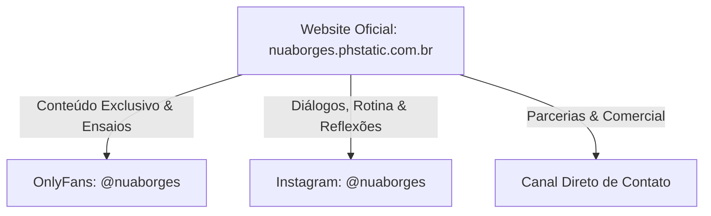

# Enciclopédia & Brand Book Oficial: Nua Borges (Lua Borges)

> **Documento Consolidado Definitivo**  
> Versão: 1.0 — Oficial & Auditada  
> Domínio Oficial Ativo: [nuaborges.phstatic.com.br](https://nuaborges.phstatic.com.br)  
> Espelho Cloudflare: [nuaborges.pages.dev](https://nuaborges.pages.dev)  

---

## 1. Perfil da Criadora & Posicionamento

| Atributo | Definição Oficial |
| :--- | :--- |
| **Nome Artístico / Marca** | **Nua Borges** *(também referenciada afetivamente como Lua Borges)* |
| **Handle / Username Oficial** | `@nuaborges` |
| **Ocupação & Titulação** | Educadora sexual \| Sexóloga em formação |
| **Conceito Central (Pilares)** | **Corpo, relações e liberdade.** |
| **Slogan Oficial** | *"Seu espaço. Seu conteúdo. Seu universo."* |
| **Assinatura & Mantra Afetivo** | *"Deixa de vergonha ♡"* |
| **Eyebrow de Abertura** | *"BEM-VINDA AO MEU MUNDO"* |
| **Tom de Voz** | Editorial, íntimo, acolhedor, sofisticado, autêntico, desinibido, sem tabus e sem rodeios. |

### 1.1 Missão e Filosofia de Conteúdo
Nua Borges posiciona-se na intersecção entre a **educação sexual reflexiva** e a **celebração livre do corpo feminino**. 
Ao contrário de modelos tradicionais e templates genéricos de plataformas adultas, o projeto Nua Borges adota uma abordagem **editorial de alto luxo** (inspirada em publicações de moda como *Vogue*, *Kinfolk* e produções artísticas autorais).
- O foco é a desmistificação do prazer e da autoimagem através do diálogo franco e da estética refinada.
- O lema *"Deixa de vergonha ♡"* convida o público a se despir de preconceitos, tabus sociais e inseguranças sobre seus próprios corpos e desejos.

---

## 2. Ecossistema Digital & Canais Oficiais

Todos os links externos foram estritamente validados e integrados ao portal:



### 2.1 Detalhamento dos Canais:
1. **Plataforma Exclusiva (OnlyFans):**
   - **URL Oficial:** [https://onlyfans.com/nuaborges](https://onlyfans.com/nuaborges)
   - **Propósito:** Espaço restrito para assinantes terem acesso integral aos ensaios fotográficos completos, produções autorais e conteúdos mais intimistas.
2. **Rede Social Principal (Instagram):**
   - **URL Oficial:** [https://www.instagram.com/nuaborges](https://www.instagram.com/nuaborges)
   - **Propósito:** Publicação de reflexões sobre educação sexual, sexologia, comportamento, estética do cotidiano e engajamento direto com a audiência.
3. **Plataforma Própria (Website / Hub Central):**
   - **URL Oficial:** [https://nuaborges.phstatic.com.br](https://nuaborges.phstatic.com.br)
   - **Fallback:** [https://nuaborges.pages.dev](https://nuaborges.pages.dev)
   - **Propósito:** Ponto focal da marca pessoal, portfólio visual dos ensaios, biografia oficial e canal seguro de direcionamento para as plataformas pagas e profissionais.
4. **Contato Profissional:**
   - Canal integrado no site para propostas comerciais, imprensa, parcerias e colaborações.

---

## 3. Identidade Visual & Brand Guidelines

A estética do projeto foi desenvolvida para transmitir luxo, sensualidade discreta e exclusividade.

### 3.1 Paleta de Cores Oficial

| Cor | Nome Técnico | Código Hex | Aplicação no Projeto |
| :--- | :--- | :--- | :--- |
|  | **Preto Absoluto** | `#000000` | Fundo principal da página, molduras naturais e contraste teatral. |
|  | **Rosa Blush Suave** | `#f4a7b9` | Cor de destaque primária: botões CTA, ícones de coração ♡, sublinhados sutis e acentos de marca. |
|  | **Rosa Intenso (Hover)** | `#efa0b3` | Estado ativo/hover dos botões de ação e interações. |
|  | **Branco Puro** | `#FFFFFF` | Tipografia dos títulos nobres, nomes em destaque e alto contraste. |
|  | **Zinco Médio** | `#A1A1AA` | Textos secundários, parágrafos informativos e metadados. |
|  | **Zinco 950 (Deep Dark)** | `#09090B` | Fundo de cards de imagem, carrosséis e gaveta do menu móvel com glassmorphism. |

### 3.2 Tipografia

1. **Serif Nobre Editorial:**
   - **Uso:** Nomes de seção, títulos de ensaios e manchetes da Hero.
   - **Sensação:** Elegância clássica, editorialismo impresso, peso sofisticado.
2. **Sans-Serif Moderna (Inter / Geist):**
   - **Uso:** Parágrafos, botões, navegação do cabeçalho e termos de privacidade.
   - **Sensação:** Clareza funcional, alta legibilidade em telas Retina/OLED.
3. **Script Cursiva / Manuscrita:**
   - **Uso:** Assinatura pessoal (*"Deixa de vergonha ♡"*) e logotipo no cabeçalho (*"Nua Borges ♡"*).
   - **Sensação:** Toque humano, íntimo, caloroso e de carta escrita à mão.

---

## 4. Acervo Fotográfico & Curadoria Visual

Todas as imagens utilizadas no projeto são fotografias reais e autorais de Nua Borges, catalogadas e otimizadas sem o uso de IA ou bancos de imagem genéricos:

```
public/images/nua/
├── hero/
│   ├── hero-1.jpg       <- Retrato de impacto primário da Hero (Slide 01)
│   └── hero-2.jpg       <- Composição editorial em iluminação suave (Slide 02)
├── about/
│   └── about.jpg        <- Retrato autoral intimista da seção "Sobre Mim"
└── gallery/
    ├── gallery-1.png    <- "Ensaio I" (Fotografia artística autoral)
    ├── gallery-2.png    <- "Ensaio II" (Linhas corporais & sombras)
    ├── gallery-3.png    <- "Ensaio III" (Composição minimalista)
    └── gallery-4.png    <- "Ensaio IV" (Sensualidade e presença natural)
```

### 4.1 Tratamento Visual Aplicado às Imagens
- **Ajuste de Luz:** Brilho calibrado em `0.96` e contraste em `1.05` para tons de pele vivos e profundos contra o fundo preto.
- **Fusão Suave:** Gradientes lineares sutis nas bordas esquerdas e inferiores para que a foto "nasça" organicamente do fundo escuro da página, sem bordas recortadas bruscas.
- **Proporções:** `aspect-[3/4]` e `aspect-[4/5]`, ideais para telas de smartphones e grids editoriais contemporâneos.

---

## 5. Arquitetura Técnica do Site Oficial

O site foi construído sob uma arquitetura de altíssimo desempenho, segurança estrita e sem custos de servidor backend:

| Camada | Tecnologia Adotada | Motivo da Escolha |
| :--- | :--- | :--- |
| **Framework Base** | Next.js 15.5.26 (App Router) | Padrão moderno de componentes e rotas com React 19. |
| **Modo de Exportação** | `output: 'export'` (Static HTML/CSS/JS) | Elimina vulnerabilidades de servidor, permite entrega instantânea no edge. |
| **Estilização** | Tailwind CSS + CSS Puro | Design responsivo sob medida, zero código CSS não utilizado. |
| **Animações** | Framer Motion (Motion React) | Transições suaves de 60/120 FPS, crossfade cinematográfico na Hero. |
| **Galeria Mobile** | CSS Scroll-Snap Nativo | Navegação por toque com aceleração por hardware GPU sem engasgos. |
| **Hospedagem & CDN** | Cloudflare Pages Global Edge | Distribuição em mais de 300 data centers no mundo, TTFB < 30ms. |
| **Segurança SSL** | Let's Encrypt / Cloudflare Universal SSL | Criptografia ponta a ponta com HTTP/2 e HTTP/3 (QUIC) ativos. |

---

## 6. Diretrizes e Regras Estritas de Marca (Guardrails)

Para preservar o valor da marca pessoal e a reputação de Nua Borges, as seguintes diretrizes são obrigatórias em qualquer expansão futura:

### ❌ O Que NUNCA Fazer:
1. **NUNCA usar linguagem vulgar ou apelos apelativos:** Evitar chamadas como *"Assine já!"*, *"Veja tudo sem censura!"*, *"Promoção imperdível!"*.
2. **NUNCA adicionar badges ou selos de dashboard:** Proibido o uso de chips de "4K", "100% Autoral", "Área VIP", "Full HD" ou contadores regressivos.
3. **NUNCA inventar métricas ou falsas promessas:** Não inserir contadores falsos de curtidas, quantidade fictícia de vídeos/fotos ou cronogramas diários inventados.
4. **NUNCA adicionar links para redes sociais não confirmadas:** Proibido inventar perfis no TikTok, X/Twitter, Telegram ou WhatsApp sem posse real do canal.
5. **NUNCA usar inteligência artificial para simular fotos:** O público de Nua Borges valoriza a autenticidade e o corpo real. Imagens sintéticas destroem a credibilidade.

### ✅ O Que SEMPRE Fazer:
1. **Preservar o equilíbrio editorial:** O site deve sempre parecer uma mistura de revista de arte com portfólio de criadora de luxo.
2. **Manter o CTA único e direto:** Um botão principal elegante para o OnlyFans na Hero e no visualizador de ensaios.
3. **Exaltar o respeito e a liberdade:** Toda cópia (copywriting) deve reforçar a autonomia, a naturalidade das relações e a quebra saudável da vergonha.

---

## 7. Relação de URLs & Referências Técnicas

- **Site em Produção:** [https://nuaborges.phstatic.com.br](https://nuaborges.phstatic.com.br)
- **URL Direta Cloudflare Pages:** [https://nuaborges.pages.dev](https://nuaborges.pages.dev)
- **OnlyFans Oficial:** [https://onlyfans.com/nuaborges](https://onlyfans.com/nuaborges)
- **Instagram Oficial:** [https://www.instagram.com/nuaborges](https://www.instagram.com/nuaborges)
- **ID da Zona Cloudflare (`phstatic.com.br`):** `5ac3a7aca812f82de627b292c9f6bf1b`
- **ID da Conta Cloudflare:** `f165980a213718a04990d66be1772f66`
- **Nome do Projeto no Pages:** `nuaborges`
